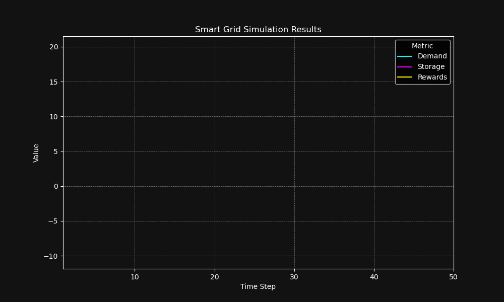
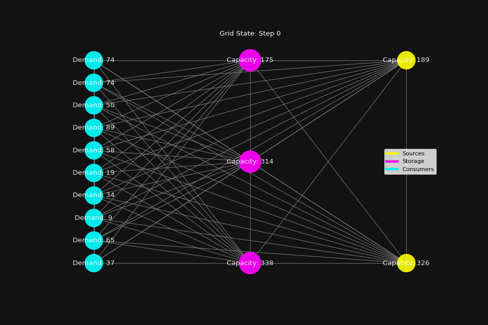

# load_balancer

This project utilizes advanced reinforcement learning techniques to optimize energy distribution and storage in a simulated smart grid environment. By simulating a dynamic grid with fluctuating demand and various energy sources, this project demonstrates an efficient approach to training an agent in managing energy resources effectively. 
The project is educational in nature but stands as a practical implementation of reinforcement learning principles.

## Environment Setup

The `LoadBalancer` class defines the simulation environment, incorporating:
- **Action Space**: Represents decisions on energy production and storage. Each dimension corresponds to a specific type of action, such as adjusting the output of different energy sources or allocating energy to storage.
- **Observation Space**: Describes the current state of the grid, including energy demand and the amount of stored energy. This provides the RL agent with the necessary information to make informed decisions.
- **Step Function**: Simulates the transition to a new state based on the agent's actions, updating demand, storage, and calculating rewards to reflect the efficiency and effectiveness of the chosen actions.

## Installation

To set up your environment for running the ReinforcedLoadBalancer project, you'll need Python 3.x and the following libraries: `gym`, `numpy`, and `stable_baselines3`. Install all dependencies using the following command:
`
pip install -r requirements.txt
`

## Training the Model

The training process is straightforward:
1. Initialize the LoadBalancer environment.
2. Create a PPO model with the environment.
3. Train the model for a defined number of timesteps.
4. Save the trained model for evaluation and further use.

## Testing the Model

To assess the model's performance:
1. Load the trained model.
2. Reset the environment to its initial state.
3. Iterate through a series of steps, allowing the model to predict actions based on the current state.
4. Render the state of the environment after each action to monitor the decision-making process.

## Usage

Running the project involves executing the Python script provided in the repository. Ensure you've installed all required dependencies. The script is structured to guide you through both training and testing phases, with comments explaining each step.

## Workflow

The interaction between the RL agent and the LoadBalancer environment is cyclic and iterative, comprising observation, decision-making, action, reward calculation, and learning. This cycle enables the agent to refine its strategy over time, aiming to optimize energy distribution in response to varying demand.

1. **Initialization**: The environment is initialized, and the RL agent begins with no knowledge of the environment.

2. **Observation**: At each timestep, the RL agent observes the current state of the environment through the observation space, which includes the current energy demand and storage levels.

3. **Decision Making**: Based on its observations and learning so far, the RL agent decides on an action to take from the action space, aiming to meet the energy demand efficiently.

4. **Action**: The chosen action is applied to the environment, adjusting energy production and storage levels as decided by the agent.

5. **Reward Calculation**: The environment responds to the action with a new state and calculates a reward based on the efficiency of the action. The reward is a measure of how well the agent's action met the demand and optimized energy usage.

6. **Learning**: The RL agent uses the reward and the transition to the new state to update its learning, refining its policy to make better decisions in the future.

7. **Loop**: Steps 2-6 repeat for a number of episodes or until a specified learning goal is achieved, with the agent continuously learning and adapting its strategy to optimize energy distribution and storage.

## Reward System
The reward system is designed to incentivize actions that align with the goal of meeting energy demand as efficiently as possible. Rewards are calculated based on the discrepancy between energy production and demand, as well as the management of energy storage. A higher reward indicates more efficient energy management, guiding the agent toward optimal strategies.

## Feedback Loop

The interaction between the RL agent and the LoadBalancer environment creates a feedback loop where the agent's actions influence the future state of the environment, and the outcomes of those actions inform the agent's future decisions, allowing it to learn and improve over time.

## Simulation Results

The simulation results demonstrate the effectiveness of the `Load_Balancer` in managing energy distribution and storage. Below is a visual representation of the demand, storage, and rewards over time, showcasing the dynamic adjustments and optimizations made by the AI agent throughout the simulation.

A visualization of the grid network, illustrating the interactions between different types of nodes, including sources, storages, and consumers. The animation approximates the actual model interactions, emphasizing the balance between energy production and consumption, offering insights into the grid's efficiency and the potential for optimization in real-time scenarios.

## Conclusion

The principles and methodologies applied in the `Load_Balancer` project can be extrapolated beyond the realm of smart grid management to broader applications:

- **Game Theory**: RL can be used to develop strategies that account for the actions of competitors and market dynamics. Particularly in scenarios involving pricing strategies and competition among multiple actors. 
- **Logistics**: It optimizes routing and resource allocation to improve efficiency and reduce costs.
- **Personalized Medicine**: Optimizing the balance between risks/rewards, and fine-tuning the efficacy of dosages vs potential side effects.
- **Portfolio Management**: Uses RL to optimize asset allocation and manage risk in financial markets.
- **Robotics**: Applies RL for tasks requiring precision and adaptability, such as navigation in unpredictable environments and manipulation of objects.
- **Smart Manufacturing**: Employs RL for optimizing production processes and predictive maintenance to prevent equipment failures.
- **Content Recommendation Systems**: Utilize RL to personalize content delivery based on user interaction, enhancing engagement.

